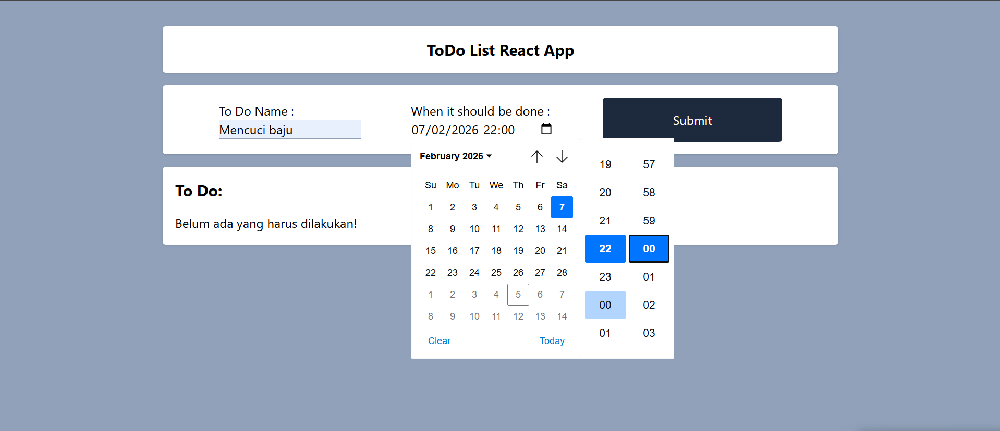
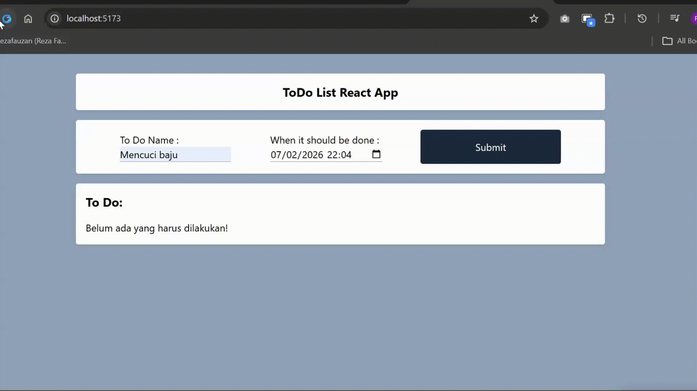

# Todo React Ref App

## Screenshoot when todo not checked

## Screenshoot when todo checked

## Demo Add Update Delete Todo Item

## How to Run it
- download source code
- install node
- npm install
- npm run dev